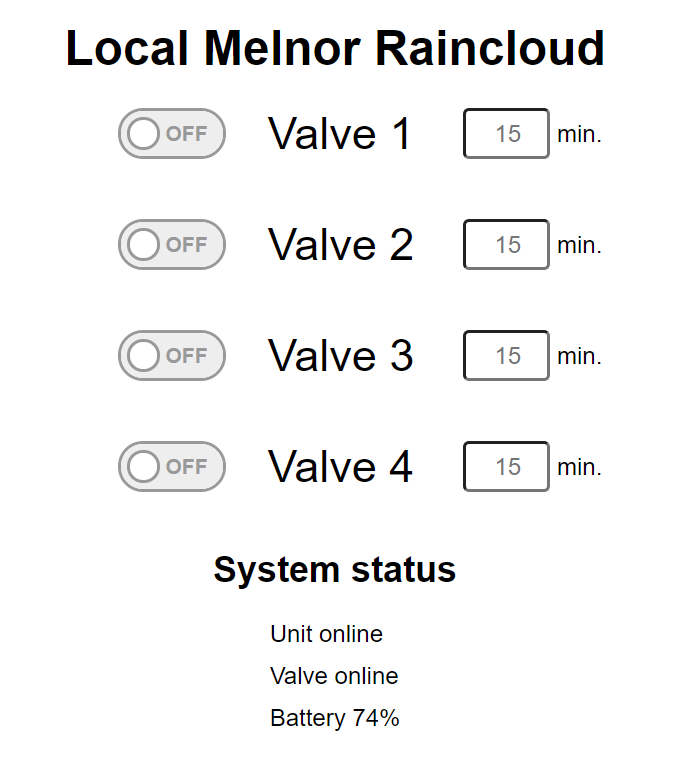

# Project Sunshower

Run your own local server for the Melnor RainCloud Wifi irrigation valve instead of using the cloud. This allows you to use a local REST API and your service will work even if the Cloud service goes down.

# How does it work ?
The RainCloud module has two parts, a valve controller which run on 4xAA batteries and an RF transmitter which connects to a router by Ethernet. The RF transmitter can connect to up to two Valve Controller and 1 humidity controller. The goal of this project is to run the RainCloud locally and control it using my home automation controller (Home Assistant).

The way the Melnor Raincloud work is by establishing a connection to 2 services:
1) A web socket connection to ws.pusherapp.com (to receive commands)
2) HTTP GET request to wifiaquatimer to report the current state of the machine

All of this run over HTTP, so if you forward the DNS of the above domain, you can capture the command and send your own command to the unit.


# Setup
## Setup DNS forwarding
There is multiple way this can be done, the way I personally use is that I have a Pi-hole V5 server handling my DNS on my network. With Pi-Hole, you can create Local DNS Records, so I have created these records:
wifiaquatimer.com  <Server_IP>
ws.pusherapp.com <Server_IP>

## Setup docker container
The easiest way to get this project running is through docker. You can use the build.sh script to build the docker image, and you can run it using the sample docker-compose.yml file. You will need to set the MELNOR_DEVICEID environment variable to match the 12-character id on your Raincloud device.


Once the service is up, you can access the UI on port 80. From there, you can see the status of your device. Both the unit and valve should appear online. If they don't, try rebooting your Raincloud.




## Running natively (without docker)
To run this program, you will need
1) Erlang 22
2) Rebar3
3) You should define the environment variable MELNOR_DEVICEID to your unit ID
4) Run the start.sh script (or run the command `sudo rebar3 shell`). Sudo is required here because by default, only root can bind on port 80.


# REST API
There are currently two requests that can be done:
1) GET /api/status
Will report the current state of the valve and information:
```json
    {
        "host_time": 1591758442367,
        "unit_status": "online",
        "valve_status": "online",
        "valve_hours": 2,
        "valve_minutes": 57,
        "valve_day": "wednesday",
        "valve_battery": 74,
        "valve1_status": "off",
        "valve2_status": "off",
        "valve3_status": "off",
        "valve4_status": "off",
        "valve1_endtime": "undefined",
        "valve2_endtime": "undefined",
        "valve3_endtime": "undefined",
        "valve4_endtime": "undefined"
    }
```

2) GET /api/control?valve={1,4}&duration={0-1440}
Duration is in minutes. A value of 0 means off
On success, you will receive a 200 OK with an empty body

# Current state of the project
* [x] Sniff and decode binary protocol
* [x] Simulate web socket and HTTP server
* [x] Implement Raincloud binary protocol
* [x] Create REST API
* [x] Create Web UI
* [x] Docker version
* [ ] Support closing valve that was started manually
* [ ] Support launching multiple valve simultaneously
* [ ] Add native scheduling rules
* [ ] Add custom labels for valves in Web UI
* [ ] Clean protocol documentation
* [ ] Add timezone support in docker containers (currently UTC)
* [ ] Clean code/add more tests
* [ ] Clean up logs
* [ ] Add Home Assistant integration
* [ ] Support multiple unit
* [ ] Proxy traffic for unrelated service to ws.pusherapp.com
* [ ] Support for pairing your valve unit

# Current limitations
This is a work-in-progress, there are probably still some bugs in here, do not use without monitoring the system.
- If you open a valve by pressing a button on the unit, you will not be able to close it through the REST API/Web UI.
- If you open a valve, it will close any other previous valve currently open.


# Other implementation
My project was started on https://hackaday.io/project/160193-raincloud-de-cloudifier

There is another implementation that you can checkout https://github.com/FreshXOpenSource/melnor_decloudify